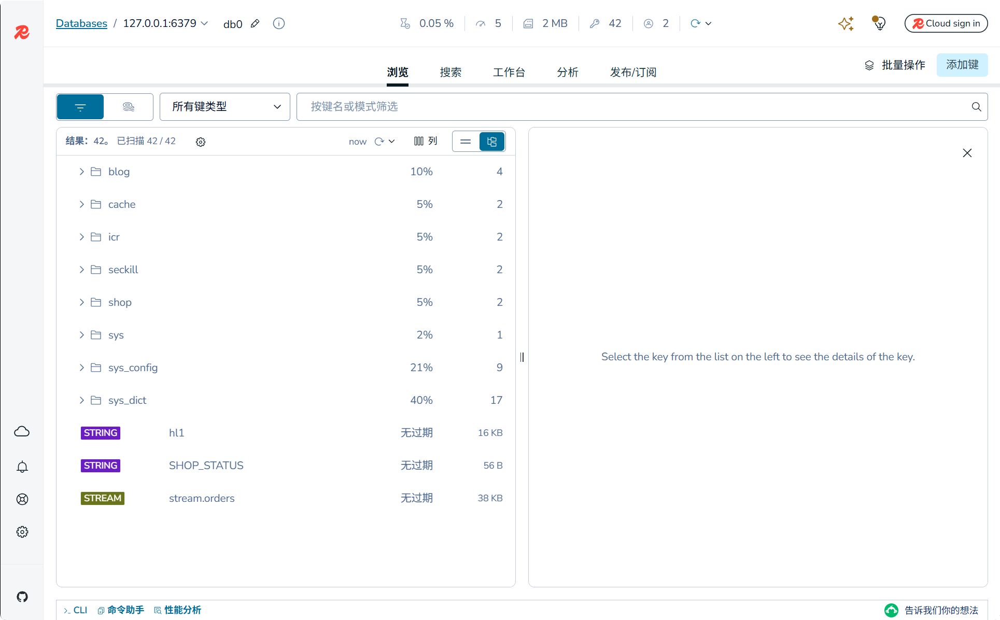
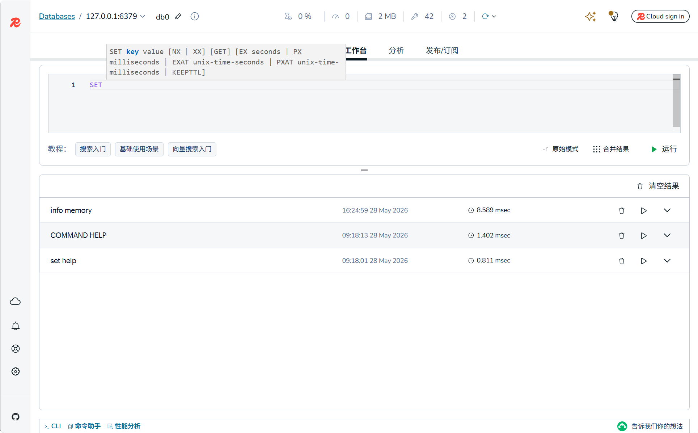
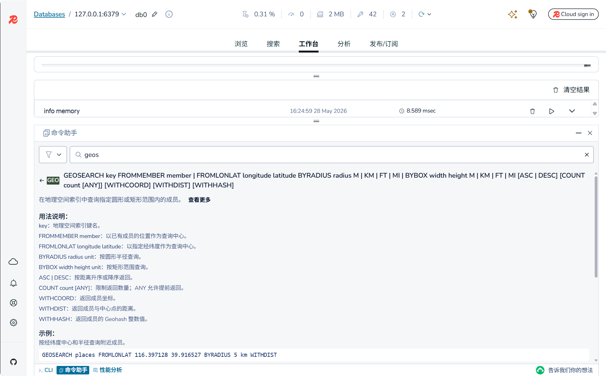

# Redis Insight 3.4.2 中文化维护版

这是基于 [redis/RedisInsight](https://github.com/redis/RedisInsight) `3.4.2` 源码制作的中文化维护版本，主要面向 Windows 用户使用。

本仓库保留官方源码结构，并在独立分支中维护中文化改动，方便后续官方升级后继续让 AI 对照维护说明重新套用中文化、验证并打包。

> 说明：本项目不是 Redis 官方发布版本，而是个人中文化维护版。Redis、Redis Insight 及相关商标归其各自权利方所有。

## 下载

请到本仓库的 [Releases](https://github.com/haoyun050303-cmyk/RedisInsight/releases/latest) 页面下载安装包：

```text
Redis-Insight-win-installer.exe
```

如果 Windows 安装时提示未知发布者，这是因为当前安装包未进行商业代码签名。确认来源是本仓库 Release 附件后再继续安装。

## 本版改动

- 中文化 Browser、Workbench、Settings、导航、数据库连接等常用界面文案。
- 修复 Command Helper 搜索命令时列表为空的问题。
- 为 Command Helper 增加中文命令摘要、参数说明和使用示例。
- 补强 `GEOSEARCH`、`BITFIELD`、`XREADGROUP`、`FT.CREATE`、`JSON.SET`、`TS.CREATE` 等命令说明。
- 新增命令助手审计测试，保证内置命令至少能生成可读的中文说明和示例。
- 增加中文化维护说明，方便后续官方升级后重新中文化并打包。

## 界面预览

### 浏览器



### 工作台



### 命令助手



## 命令助手说明

命令助手保留 Redis 命令名、关键字和语法占位符的英文原文，例如 `SET key value`、`GEOSEARCH`、`XREADGROUP`。中文化只覆盖解释性内容：

- 命令用途摘要
- 参数含义说明
- 常用示例
- 高风险命令的谨慎提示

这样既方便中文阅读，也避免把 Redis 原生命令语法翻译错。

## 维护说明

后续如果官方 RedisInsight 升级，可以参考维护文档继续更新中文化版本：

- [中文化维护说明](docs/chinese-localization-maintenance.md)
- 推荐维护分支：`codex/chinese-ui`
- 源码目录：`F:\RedisInsight`
- 轻量发布目录：`F:\RedisInsight-publish`

推荐流程：

1. 拉取官方新版源码。
2. 对照当前中文化提交和维护文档重新套用改动。
3. 运行命令助手测试和 `git diff --check`。
4. 本地启动页面，手动检查 Browser、Workbench、Settings、Command Helper。
5. 验收通过后再打包 Windows 安装包并发布 Release。

## 已验证内容

- Command Helper 审计测试通过。
- Command Helper 相关 Jest 测试通过。
- `git diff --check` 通过。
- Windows 安装包已成功构建。

## Windows 打包记录

本版本使用 Visual Studio Build Tools 2022 构建成功，打包命令记录在维护文档中。当前生成的安装包位于：

```text
F:\RedisInsight\release\Redis-Insight-win-installer.exe
```

发布到 GitHub Release 时，通常只需要上传这个安装包即可。

## 官方项目

- 官方仓库：[redis/RedisInsight](https://github.com/redis/RedisInsight)
- 官方网站：[redis.io/insight](https://redis.io/insight/)
- 官方文档：[Redis Documentation](https://redis.io/docs/)

## License

Redis Insight 使用 [SSPL](LICENSE) 许可证。本中文化维护版沿用官方项目许可证。
